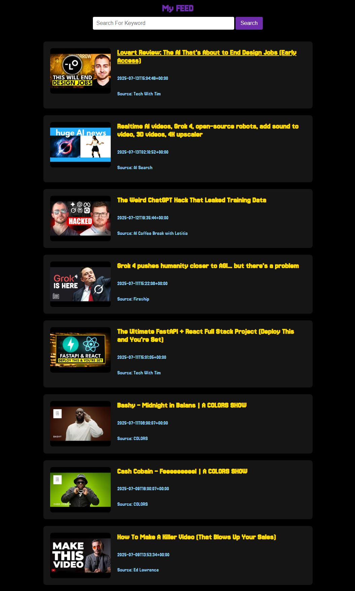

# YouTube RSS Feed Aggregator

A Flask web app that aggregates and displays the latest videos from multiple YouTube channels using their RSS feeds. Features include search (by video title or channel name), pagination, and YouTube video thumbnails.

## Interface



## Features

- Aggregates latest videos from multiple YouTube channels
- Displays video thumbnails, titles, publish dates, and source channel
- Search by video title or channel name
- Pagination for easy browsing
- Responsive, modern UI

## Setup Instructions

### 1. Clone the repository

```bash
git clone <your-repo-url>
cd RSS_FEED
```

### 2. Create and activate a conda environment

```bash
conda create -n rss-feed python=3.9 -y
conda activate rss-feed
```

### 3. Install dependencies

```bash
pip install -r requirements.txt
```

### 4. Run the app

```bash
python app.py
```

The app will be available at [http://127.0.0.1:5000](http://127.0.0.1:5000)

## Project Structure

```
RSS_FEED/
├── app.py
├── requirements.txt
├── README.md
├── static/
│   └── style.css
├── templates/
│   ├── base.html
│   ├── index.html
│   └── search_results.html
└── .gitignore
```

## Notes

- The app uses YouTube's public RSS feeds, which only provide the latest 15 videos per channel.
- Shorts are filtered out by default.
- To add or remove channels, edit the `RSS_FEEDS` dictionary in `app.py`.
- The search matches both video titles and channel names.

## License

MIT
